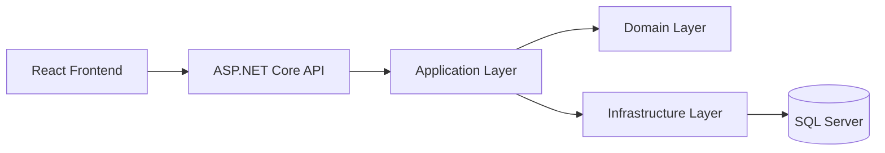

# Architecture

## Clean Architecture Layers

- Domain: entities, constants, exceptions, domain events
- Application: DTOs, interfaces, validators, CQRS handlers, mapping, pipeline behaviors
- Infrastructure: EF Core persistence, repositories, UnitOfWork, token services, identity services
- API: controllers, middleware, DI composition, security, health checks, rate limiting

## Request Flow

1. API controller receives request.
2. MediatR command/query is dispatched.
3. Application handlers invoke services and repository interfaces.
4. Infrastructure implements persistence and security.
5. Result is returned via standardized response payload.

## Diagram

