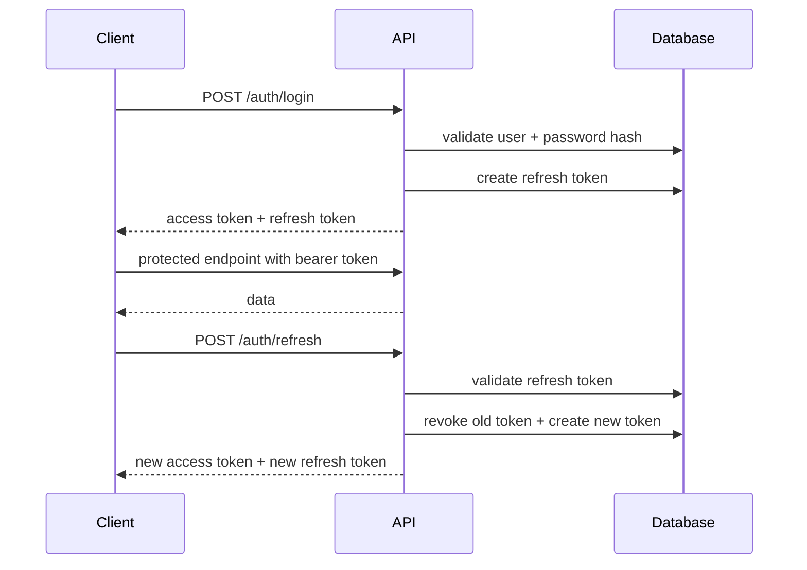

# Authentication Flow

```mermaid
sequenceDiagram
  participant C as Client
  participant A as API
  participant D as Database

  C->>A: POST /auth/login
  A->>D: validate user + password hash
  A->>D: create refresh token
  A-->>C: access token + refresh token

  C->>A: protected endpoint with bearer token
  A-->>C: data

  C->>A: POST /auth/refresh
  A->>D: validate refresh token
  A->>D: revoke old token + create new token
  A-->>C: new access token + new refresh token
```